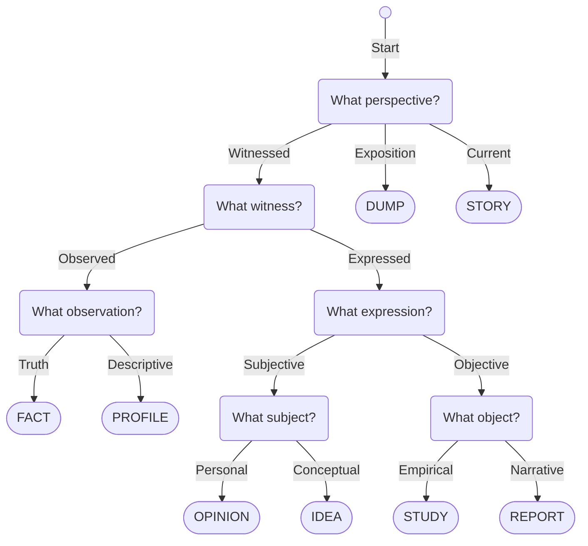

---
{"dg-publish":true,"permalink":"/material/note/no-0004/","title":"Material Categories","tags":["-note","-meta"]}
---

>[!empty]
>  <u class="title">Material Categories</u> NO0004 <b class="title"> </b>
> Meta document to list, identify, and organize point & chapter materials files by various categories — fact, opinion, idea, report, profile, study, moment, dump.
> 
> <b>meta | article | category | group | sort | criteria | format</b>
{ #profile}

| Category | Description                                                                      | Key Identifier                           | Key Remark                                                                           | Examples                                                                                                                                |
| -------- | -------------------------------------------------------------------------------- | ---------------------------------------- | ------------------------------------------------------------------------------------ | --------------------------------------------------------------------------------------------------------------------------------------- |
| Fact     | Standalone, objective observation or fact reported without interpretation        | As **objective**\* fact or truth         | Defaults to true, but new studies or research can contradict the fact                | fact, observation, record, data, truth                                                                                                  |
| Opinion  | Personal, subjective judgment or opinion given from a perspective                | As **subjective**\* opinion or judgment  | Ranges from neutral or truthful, to biased or falsified                              | opinion, judgement, thought, critique, review, perspective, reaction,                                                                   |
| Idea     | Conceptual or resourceful ideas perceived by people                              | As **perceived**\* concept or idea       | Perceived as a concept by many, by itself is not necessarily true nor false          | idea, theory, conspiracy, guide, how-to, instructions, manuals, concept, art, book, novel, movie, film, poetry, essay, textbook, music, |
| Report   | Narrative account of an event, incident, or update                               | As **witnessed**\* report or event       | Defaults to true, but can be false from personal bias or poor research               | news, report, tabloid, interview, history,                                                                                              |
| Profile  | Neutral descriptive profile of a person, group, or brands                        | As **descriptive**\* profile or overview | Always descriptive, otherwise it counts as something depending on framing or context | profile, biography, overview, autography, description, account,                                                                         |
| Study    | Research-based study or any particular subject                                   | As **empirical**\* study or analysis     | Defaults to true, but can be false from personal bias or poor research               | study, research, analysis, survey, research journal, research paper, case study                                                         |
| Story    | Story viewed or narrated within their respective settings                        | As **current**\* event and happening     | Reserved for "element" materials, and must be marked as story                        | story, history, epic, entry                                                                                                             |
| Dump     | Miscellaneous notes and remarks of the material viewed as omniscient perspective | As **omniscient**\* note and remarks     | Used if the material is described from external or fourth-wall perspective           | wiki, dump, note, remark                                                                                                                |
- **Remark**: Examples only cover specific mediums. For example, "video" is not included as it can be split into Idea as creative media or "film", or Report as news media or "news".

